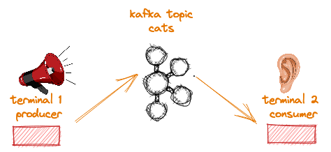
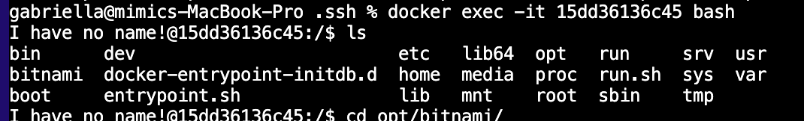
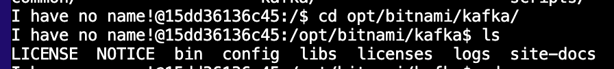
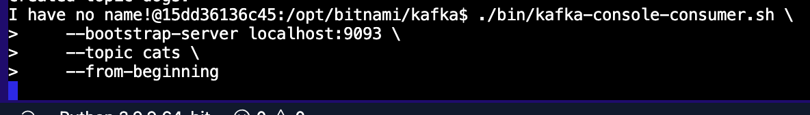
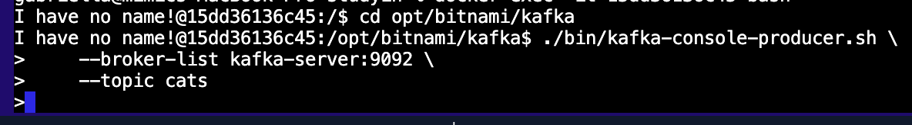
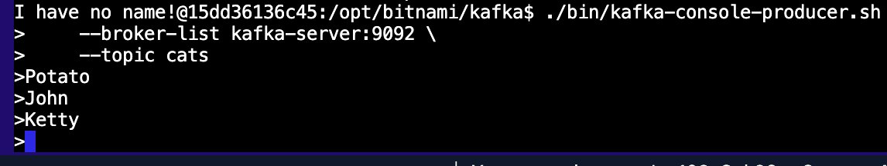
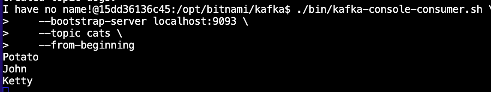
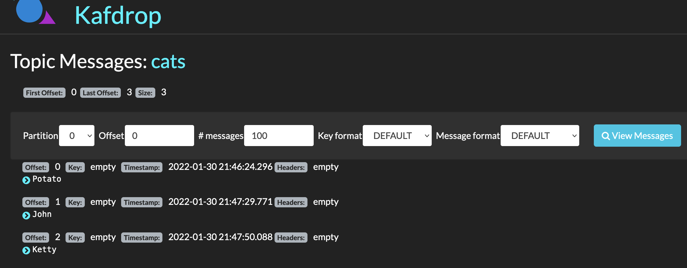

# kafka demonstration - level 1 

in this tutorial, we'll reproduce the following structure:



if you're not familiar with the initial concepts of Kafka, I recommend two materials:
- [this very cute visual guide to understand the power of Kafka](https://www.gentlydownthe.stream/)
- [this didactic medium article by Timothy Stepro](https://timothystepro.medium.com/visualizing-kafka-20bc384803e7)

# environment composition:
- [x] 1 Kafka broker
- [x] 1 Zookeeper server
- [x] 1 Kafdrop interface (to observe topics and messages)

# prerequisites 
- Docker

:mega: :mega: :mega: :mega: :mega: :mega: open docker-compose.yml file while reading the explanations :mega: :mega: :mega: :mega: :mega: :mega:
# about our configs (yml)
### ports
  the ports statement exposes the container’s port xxxx on the host’s port yyyy (example):
  ```
     ports:
     - "yyyy:xxxx" (thus, my local port yyyy will be able to access the xxxx container's port)
   ```

### kafka container:
  ```
    - ALLOW_PLAINTEXT_LISTENER=yes
    - KAFKA_LISTENER_SECURITY_PROTOCOL_MAP= CLIENT:PLAINTEXT,EXTERNAL:PLAINTEXT     
   ```
  
  *Defines key/value pairs for the security protocol to use, per listener name.*
  ```
    - KAFKA_ADVERTISED_LISTENERS= CLIENT://kafka-server:9092,EXTERNAL://localhost:9093
   ```
  *Describes how the host name that is advertised can be reached by clients. The value is published to ZooKeeper for clients to use. PLAINTEXT means Un-authenticated, non-encrypted channel. Other valid protocols can be found [here](https://kafka.apache.org/11/javadoc/org/apache/kafka/common/security/auth/SecurityProtocol.html).*
  ```
    - KAFKA_ZOOKEEPER_CONNECT= zookeeper-server:2181
    - KAFKA_INTER_BROKER_LISTENER_NAME=CLIENT
   ```
  *Defines which listener to use for inter-broker communication.* 
  ```
     - KAFKA_LISTENERS= CLIENT://:9092,EXTERNAL://:9093
   ```
  *In a multi-node (production) environment, you must set the KAFKA_ADVERTISED_LISTENERS property in your Dockerfile to the external host/IP address. Otherwise, by default, clients will attempt to connect to the internal host address.*

### kafdrop:
  ```
     - KAFKA_BROKERCONNECT: "PLAINTEXT://kafka-server:9092"
   ```
   *Has to be connected to all brokers individually to show its topics and values. If more than one broker is set, config pattern is "host:port,host:port"*

   Sources: 
   [Kafdrop](https://github.com/obsidiandynamics/kafdrop), [Confluent1](https://docs.confluent.io/platform/current/kafka/multi-node.html#), [Confluent2](https://docs.confluent.io/platform/current/installation/docker/config-reference.html)
# Docker
## Starting the containers

from inside the project folder (same directory where docker-compose.yml is), type on terminal ` $ docker-compose up`, so the environment can be brought up. 
then, type `$ docker ps` to list all running process. if it all went well, you must see 3 lines, corresponding to the 3 services we've set on the yml file (zookeeper, kafka and kafdrop). **similarly** to this:


| CONTAINER ID | IMAGE                    | COMMAND                | CREATED            | STATUS            | PORTS                                                                   | NAMES                    |
|--------------|--------------------------|------------------------|--------------------|-------------------|-------------------------------------------------------------------------|--------------------------|
| 159af0dc18a3 | obsidiandynamics/kafdrop | "/kafdrop.sh"          | About a minute ago | Up About a minute | 0.0.0.0:9000->9000/tcp, :::9000->9000/tcp                               | kafka_kafdrop_1          |
| 8ca68d16a24e | bitnami/kafka:2          | "/opt/bitnami/script…" | About a minute ago | Up About a minute | 0.0.0.0:9092-9093->9092-9093/tcp, :::9092-9093->9092-9093/tcp           | kafka_kafka-server_1     |
| 123040c85f6c | bitnami/zookeeper:3      | "/opt/bitnami/script…" | About a minute ago | Up About a minute | 2888/tcp, 3888/tcp, 0.0.0.0:2181->2181/tcp, :::2181->2181/tcp, 8080/tcp | kafka_zookeeper-server_1 |

now, we're gonna execute bash into the kafka container, so we can access kafka's scripts and send some messages to our cluster. at the same time, we we'll be listening to these messages.

by getting the output of *docker ps* command, you found the kafka server's container ID. next step is (from any directory) using `$ docker exec -it YourKafkacontainerID bash` command, obtain access to the inside of our Kafka Container. in order to send messages and listen to them at the same time, you must repeat the same command in two different terminals! (by my example, the command would be docker exec -it 8ca68d16a24e bash)

now that you got two amazing :ghost: terminals accessing the kafka server, let's create a topic.

from inside your cluster, navigate to kafka folder by typing `$ cd opt/bitnami/kafka/`. now, if you type `$ ls`, you'll be able to see the kafka files! these are the files you get if you natively install Kafka on your machine. the executable files (scripts) are inside the */bin* folder, just like any unix-based system.

system files, after executing bash:



kafka files:



now, we have to create one topic. this topic is the "bucket" to where the messages will be sent, from where they can be listened, but eventually (or not, depending on the retaining policy config you set) it will be emptied.

use this command to create a topic named **cats**:
```
$ ./bin/kafka-topics.sh  --create --bootstrap-server localhost:9093 --topic cats
```
- ./ is used to execute a shell script    
- kafka-topics.sh is one of the native shell scripts inside kafka files (that can be used for a bunch of things)
- bootstrap-server's parameter is the kafka broker address, where the topic will be created. it has to be externally reachable if you are contacting the broker from out of this container, that's why we used localhost:9093 and not kafka-server:9092. but, since we're interacting from inside the broker specifically now, **the command will work with both addresses**. give it a try :)


## Are you listening ?

now we set an ear to LIVE listen the messages, before screaming out loud. from this same terminal, enter the command
```
$ ./bin/kafka-console-consumer.sh \
    --bootstrap-server localhost:9093 \
    --topic cats \
    --from-beginning
```

it also uses one of the native scripts to listen to topics. same rule about the bootstrap-server parameter applies to this script calling. the last parameter is about the messages offset. it refers to the choice of listening the messages from the beginning or from a specific index.

a total silence takes over the room. the terminal will keep busy, no response means you **got it**. 



keep this window aside, waiting, and move to the other terminal, where the container bash is still standing after that *docker run* command.


## Raise your voice

one topic to hold the messages, a consumer to hear them. now, we can sail some cat names. to produce messages we can also use a native kafka script. 
```
$ ./bin/kafka-console-producer.sh \
    --broker-list localhost:9093 \
    --topic cats
```

no secrets about these parameters. the terminal will keep busy because it will be waiting for your input (or be, the streaming messages):



so you can start typing! as long you type new messages on producer terminal, they will automatically be stored on the cats topic and appear on consumer terminal.





# Fast overview

to observe all topics, its partitions, its messages, and other things, you can use Kafdrop interface. since the containers are still up, and we exposed our port 9000 to interact with the service (on docker-compose.yml file), it's enough going to your browser and typing http://localhost:9000/
to have access to Kafdrop interface
        
          


have fun with it! find the *cats* topic, click at the gray *view messages* button, select partition 0 (since we only have this one) and click at the blue *view messages* button: 

    

